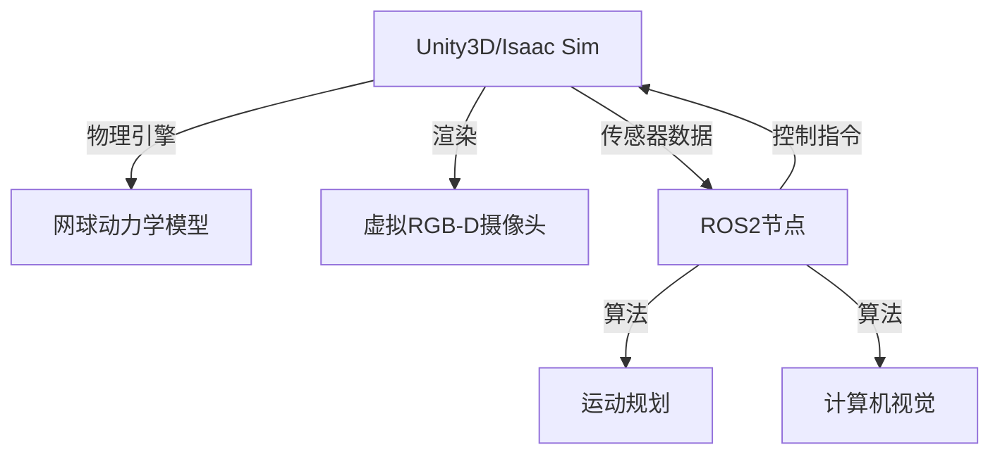

# opencamp_project3
2025 具身智能机器人目标检测算法大赛，回归天空组初赛内容，赛题c

## 仿真
1. opencv或者unity实现一个黄绿色球状物充当网球
2. pybullet或者unity实现模拟小车底盘
3. 机械臂，运动学模型模拟关节控制
4. 距离计算，unity模拟
> 仿真的具体实现工具待定，如果会用ros,那就不用unity或者其他仿真工具
## 控制
1. 网球识别
2. 底盘运动控制
3. 机械臂控制
4. 状态机

## 中间件

## 主模块交互和信息处理

